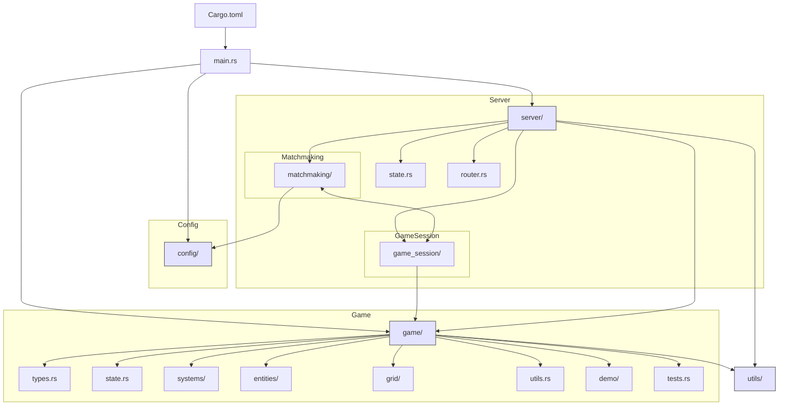

# Backend Architecture – Overview

This Mermaid diagram shows the main structure of the backend, its modules, and their interactions.

---

---

**Legend:**

- Boxes represent main folders/files.
- Arrows indicate primary dependencies or calls.
- Subgraphs show the hierarchy of modules.

**Update this section if you add or move modules.**
